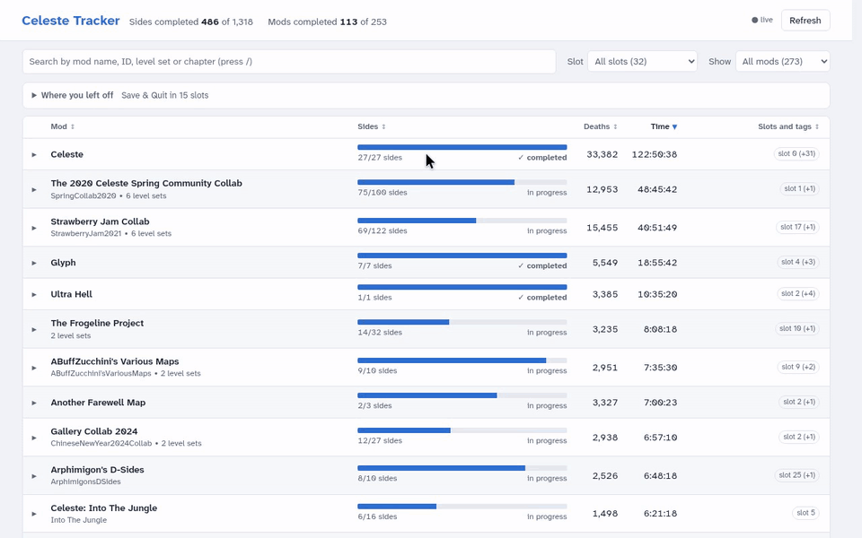
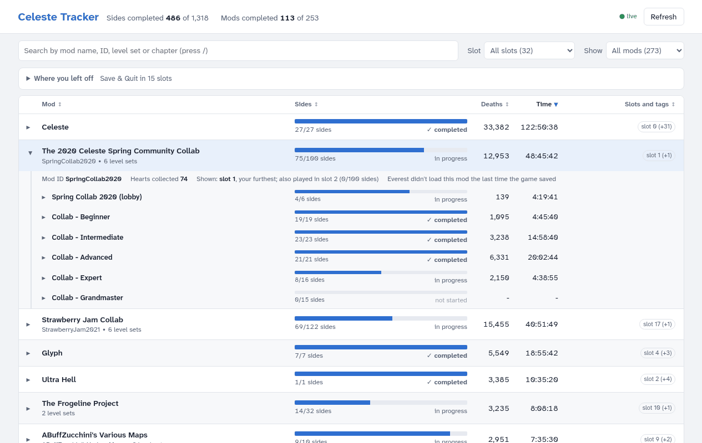
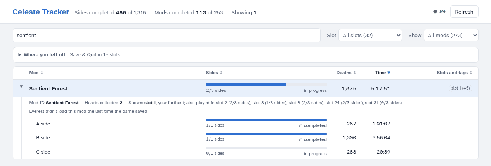

# Celeste-tracker

See your Celeste mod progress straight from the save files, without enabling the mods (loading many mods slows the game down). Standard library only.

One row per **mod**, named the way you know it from Olympus (its GameBanana title), with collabs split into their level sets underneath. Progress is counted in **sides**: a chapter's A, B and C sides each count once, and a side is done when it's cleared (crystal hearts are shown, but don't count). By default all your save slots are shown together: each mod shows the slot where you got furthest in it (the row says which), and opening it lists the other slots you played it in.

With `--mods` it reads your Mods folder (zip file lists, `everest.yaml` and `Dialog/English.txt` only) for each mod's chapters and sides and their in-game titles. Mod names come from Everest's public mod list (the same one Olympus uses), downloaded once a week and cached; nothing about your saves is sent. Without internet it uses the chapter's title, then the level set's title, then the mod's ID.

## Demo



| Every mod, from the slot you got furthest in | A collab opens to its tiers | One mod opens to its sides |
|---|---|---|
| [](doc/media/overview.png) | [](doc/media/collab.png) | [](doc/media/sides.png) |

*The author's own saves: 32 slots, about 270 mods.*

> **Made with AI.** Most of this project's code and docs were written with an AI coding assistant ([Claude Code](https://claude.com/claude-code)), directed, reviewed and tested by the author on their own saves and Mods folder. It can still have mistakes, so if a number looks wrong, compare it with the game and [open an issue](https://github.com/sam1037/celeste-tracker/issues). The tool only reads your files, so a bug can show wrong progress but can't change your saves or mods.

## Download (players)

Get the zip for your system from the [Releases page](https://github.com/sam1037/celeste-tracker/releases), unzip it anywhere, and start it. It finds your Celeste folder by itself (from Olympus or Steam); if it can't, it asks you to pick the folder Celeste is installed in. Your progress shows up as a page in its own window, and follows the game while you play.

- **Windows:** unzip, open the `CelesteTracker` folder, run `CelesteTracker.exe`. Windows may warn that the app is from an unknown publisher: click *More info*, then *Run anyway*.
- **macOS** (not the main platform, see below): unzip and move *Celeste Tracker* to Applications. The app isn't signed, so the first time, open it, close the warning, then go to System Settings > Privacy & Security and click *Open Anyway*.
- **Linux:** run it from source (below): `uv run --extra desktop celeste_desktop.py`, or `uv run celeste_progress.py --serve` for the page in your browser.

**Windows is the supported platform.** It's what the author plays on, and every change is tested there on real saves. The macOS app is built from the same code and has been run on a Mac, but it gets far less testing and isn't signed; treat it as a bonus. Bug reports are welcome either way.

It only reads your saves and mods, and never changes them. Its own files (notes, ratings, caches, `desktop.log`) are in `%APPDATA%\celeste-tracker` on Windows and `~/Library/Application Support/celeste-tracker` on macOS.

## Run from source

```bash
S="/mnt/c/Program Files (x86)/Steam/steamapps/common/Celeste/Saves"   # Windows saves, from WSL

uv run celeste_progress.py --saves "$S" --mods --save-config         # once: remember the folders
uv run celeste_progress.py --serve                                   # the page: open http://localhost:8765
uv run celeste_progress.py                                           # every mod, from its furthest slot
uv run celeste_progress.py --slot 1                                  # one slot, with its unfinished chapters
uv run celeste_progress.py --set "Sentient Forest"                   # one mod: its chapters and sides, and the slots you played it in
uv run celeste_progress.py --note hikki "stopped at the ice part"
uv run celeste_progress.py --rate "Sentient Forest" 5             # also: --difficulty KEY LEVEL, --tag / --untag KEY TAG, --drop / --undrop KEY
uv run celeste_progress.py --rename mindcrack "MINDCRACK"           # your own name for a mod ("" undoes it)
uv run celeste_progress.py --markdown progress.md
uv run celeste_progress.py --json progress.json                      # everything parsed, for other tools ('-' = stdout)
uv run celeste_progress.py --slot 1 --dump                           # raw XML outline, for debugging
```

`python -m celeste_tracker` works the same as `celeste_progress.py`.

`--serve [PORT]` starts a local page (only reachable from your own computer) with the same data: one table row per mod with its A/B/C progress, the slot it comes from, search, a slot picker, a Filter panel (status, your rating, difficulty, tags and note), columns you can show, hide and resize, and sorting by any column header. Click a mod to open it: a collab opens to its level sets, each level set to its chapters, and a chapter to its A/B/C sides. Rate a mod with the stars in its row, and click ✎ Edit (or open it) to set how hard it is for you, add tags and write a note. The page reloads by itself when the game saves, and the URL keeps what you opened and filtered, so a view can be bookmarked. The ? button explains the page. Its design plan is `doc/UI.md`.

`--save-config` stores `--saves` and `--mods` in a config file (`~/.local/share/celeste-tracker/config.toml` on Linux/WSL, `%APPDATA%\celeste-tracker\config.toml` on Windows). Later runs use it; flags still win, and `--no-mods` skips the Mods folder. The store (`tracker.db`: your notes and ratings, plus a cache of the Mods folder scan) and the mod list cache (`moddb.json`) sit next to it; `--offline` never downloads, `--refresh-moddb` downloads now. Without a config, the tool looks in the default Saves folder for your OS. Under WSL you need `--saves` or the config.

`--set` takes a mod's name or ID, a level set's ID or title, or a unique part of one; a collab's level set shows just that tier. `--note`, `--rate`, `--difficulty`, `--tag`, `--untag`, `--drop` and `--rename` take a mod's name or ID, or a unique part of one. `--difficulty` is one of Beginner, Intermediate, Advanced, Expert or Grandmaster. They are kept in `tracker.db` next to the config, and show on the page, in the Mine column and in `--set`. Notes from an old `celeste_notes.json` are imported on the first run (or with `--import-notes FILE`).

Statuses: a side is *completed* (cleared), *in progress* or *not opened*; ♥ marks a collected crystal heart. A mod or level set is *complete*, *in progress*, *started*, *not started*, or *all opened done* when the mod isn't in the Mods folder to give the real totals (those totals are marked `?`).

The tool only reads your saves and mods; it never writes to them.

## Develop

```bash
uv run pytest                                  # tests use made-up saves in tests/fixtures, never real ones
uv run --extra desktop celeste_desktop.py      # the desktop window (--browser for the browser, --saves, --config)
uv run --group build --extra desktop pyinstaller packaging/celeste-tracker.spec --noconfirm   # build for this OS
```

Releases: push a tag like `v0.2.0`, and `.github/workflows/release.yml` tests, builds Windows and macOS, and publishes both zips. *Run workflow* on the Actions tab builds without publishing.

## Files

- `celeste_tracker/`: the code (layout in `doc/DESIGN.md`); `celeste_progress.py` (CLI) and `celeste_desktop.py` (window) are thin entry points
- `packaging/`: the PyInstaller spec for the downloads
- `tests/`: pytest tests and made-up fixture saves
- `doc/PRD.md`: goal, users, requirements and the definition of "completed"
- `doc/DESIGN.md`: tech stack and architecture
- `doc/UI.md`: the design plan for the `--serve` page
- `doc/NOTES.md`: build status, the save format and open questions
- `local/`: your own save copies for testing (gitignored)
